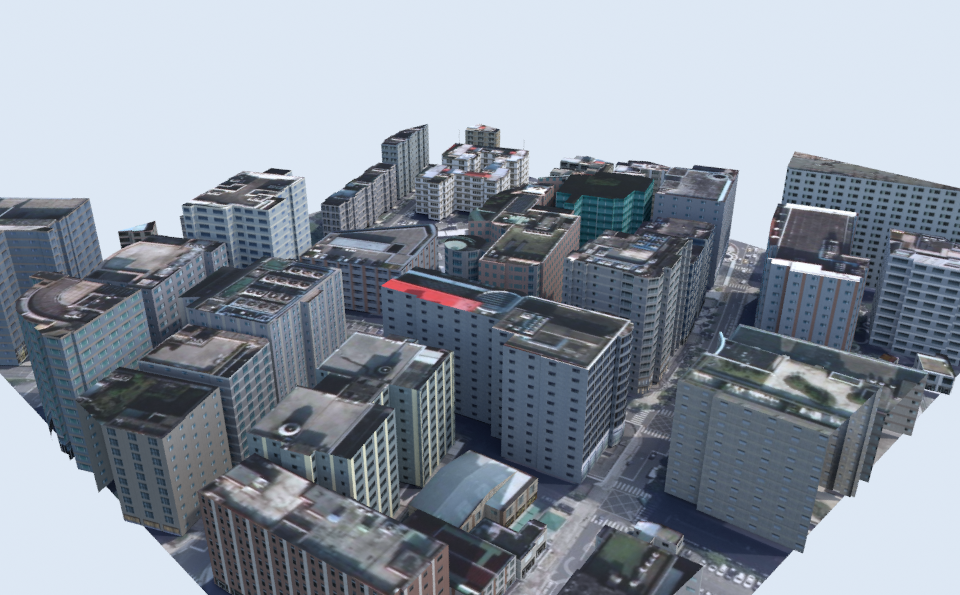
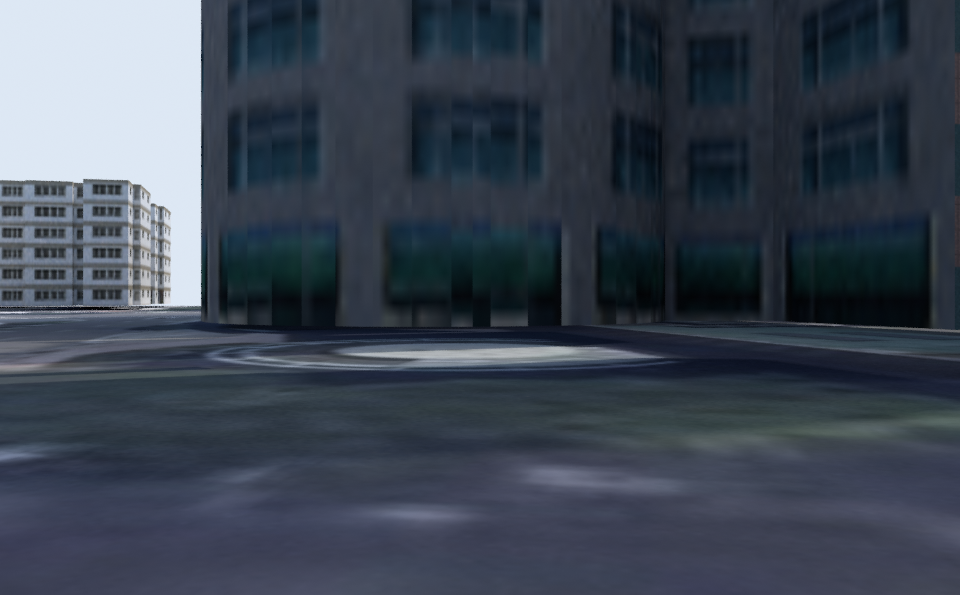

# modalpoc — 瑞光路 186 號街區 3D 地景（Blender + Modal + three.js）

以台北市內湖區瑞光路 186 號（台達電子總部）為中心、約 300 m × 300 m 的小範圍，
在 Modal 雲端用 **portable Blender 4.2 LTS** 建模、烘焙光照到貼圖、降面，輸出單一 `scene.glb`，
再用 three.js 做網頁 360° 多視角檢視。

```
pipeline/
  fetch_opendata.py   OSM 建物輪廓 + 高度、NLSC 正射影像（授權乾淨、免 Google key）
  fetch_google3d.py   Google Photorealistic 3D Tiles 抓取（需開通 Map Tiles API，見 docs/）
  blender_build.py    bpy：建模 → Cycles bake（COMBINED / DIFFUSE）→ decimate → glTF 匯出 → 預覽圖
  modal_app.py        Modal App：Blender portable image、L4/A10G/L40S GPU、Volume 輸出
  geo.py              WGS84 / ECEF / ENU / Web Mercator tile 數學
web/
  index.html          three.js 檢視器：6 個 Blender 預設視角、自動 360° 環繞、線框
  live3dtiles.html    Google 3D Tiles 串流檢視（符合 Google 條款的高擬真路線）
  assets/scene.glb    產出（由 modal run 下載）
docs/google-api-handbook.md   必須開通的 Google API、Key 限制、費用試算、條款
.claude/skills/               three.js / Blender→web skills（見該目錄 README）
```




## 快速開始

```bash
pip install modal requests pillow
export MODAL_TOKEN_ID=ak-...  MODAL_TOKEN_SECRET=as-...

# 1) 雲端建模 + bake（L4 GPU，約 3–6 分鐘；第一次多 2–3 分鐘建 image）
modal run pipeline/modal_app.py --lat 25.0740 --lon 121.5775 --half-size 150 \
    --bake-res 4096 --ground-res 4096 --samples 96 --target-tris 80000 --gpu l4

# 2) 網頁檢視（需 http 伺服器，不能直接雙擊 html）
cd web && python -m http.server 8080     # 開 http://localhost:8080/
```

參數：`--gpu l4|a10g|l40s|none`、`--samples`（bake 取樣數）、`--bake-res`（建物貼圖）、
`--ground-res`（地面貼圖）、`--target-tris`（decimate 目標三角形數）、`--mode opendata|google3d`。

本機（不用 Modal）也可跑：`pip install bpy==4.2.0` 後
`python pipeline/fetch_opendata.py --lat 25.0740 --lon 121.5775 && python pipeline/blender_build.py --site build/site/site.json --out build/out`。

## 部署到 GitHub Pages

`web/` 是純靜態站（three.js 已 vendor、`assets/scene.glb` 進 repo），`.github/workflows/pages.yml` 會在 push 到
`main` 或 `claude/**` 時把 `web/` 發佈到 Pages。只要在 repo **Settings → Pages → Source 選 “GitHub Actions”** 一次即可，
之後網址是 `https://<user>.github.io/modalpoc/`。手動觸發：Actions → “Deploy web/ to GitHub Pages” → Run workflow。

## 台達總部（hero）與其他建物

- **Hero**（`pipeline/hero.py`）：OSM 弧形輪廓（`w343901574`，9 層 30.7 m）→ 帷幕玻璃主體、每層外挑樓板、女兒牆、
  屋頂太陽能板陣列（南向 15°）、機房/樓梯間、綠屋頂、廣場玻璃圓亭；獨占一張 4096² bake 貼圖。
- **其他建物**：LOD1 擠出 + 女兒牆 + 屋頂水箱，依 OSM `building` 標籤選玻璃辦公/一般辦公/公寓三種程序化立面，
  合併成一個 mesh、共用一張 4096² 貼圖（遊戲風：有質感、不細節）。
- **地面**：NLSC 2024 正射影像 + 建物投影（太陽方位對齊正射影像原本的陰影）。

Google Photorealistic 3D Tiles 在此區只有 2.5D 貼圖地形（實測見 docs），所以 hero 不走 Google。

## 兩條「高擬真」路線

| 路線 | 幾何來源 | 擬真度 | 條件 |
|---|---|---|---|
| A. `web/live3dtiles.html` | Google Photorealistic 3D Tiles 串流 | 視 Google 涵蓋而定（**內湖此區實測只有 2.5D 貼圖地形**） | 開通 Map Tiles API；每次載入 = 1 個 root 請求（每月 1,000 次免費） |
| B. `--mode google3d` | 同上，下載 → Blender 合併/裁切/decimate/重新 bake 成單一 GLB | 同上 | 同上；**但違反 Google Map Tiles 政策的「不得儲存/離線使用/擷取」條款**，僅供內部實驗 |
| C. `--mode opendata`（預設） | OSM 輪廓 + 高度、NLSC 2024 正射影像、程序化立面 | 中（LOD1 + 真實地面） | 免 key、授權乾淨，可公開發佈 |

細節與費用見 [docs/google-api-handbook.md](docs/google-api-handbook.md)。
